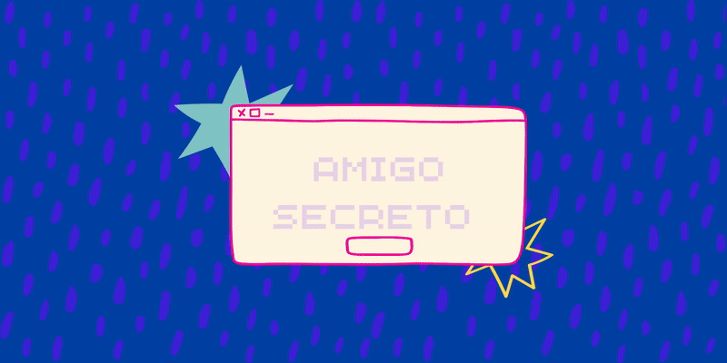
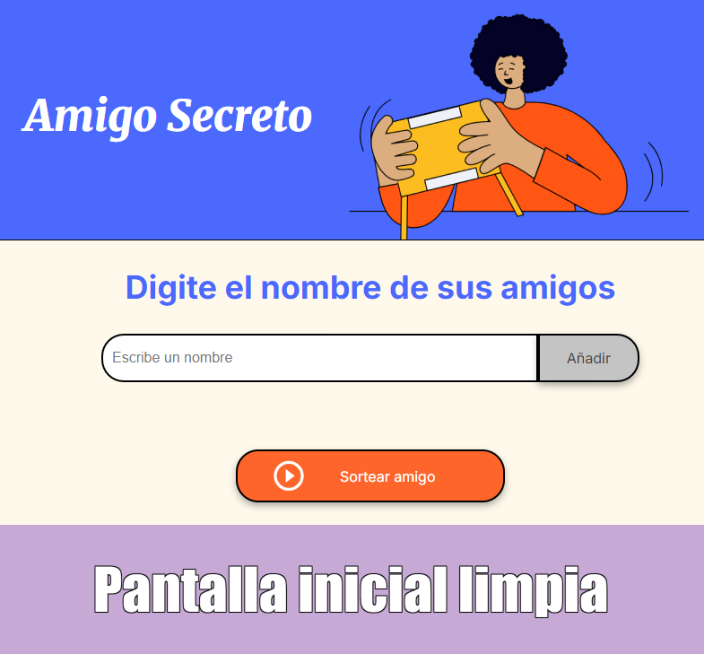
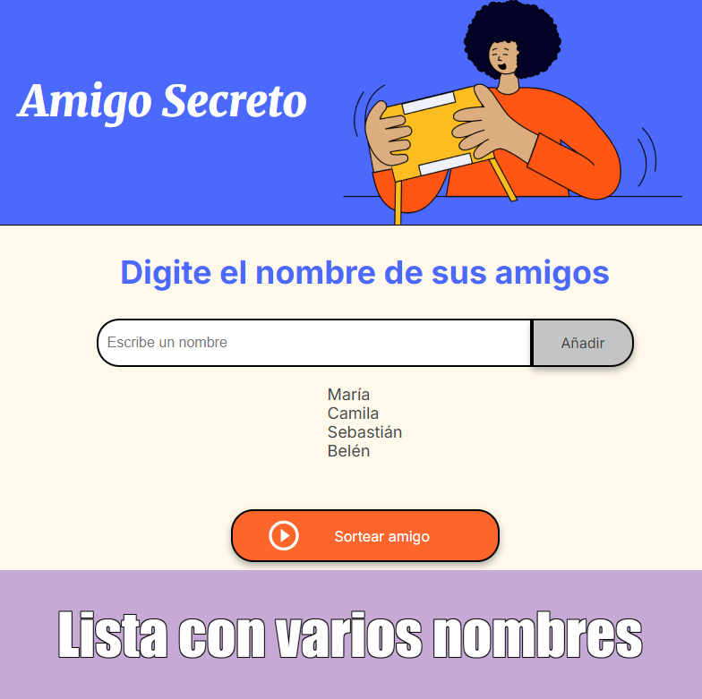
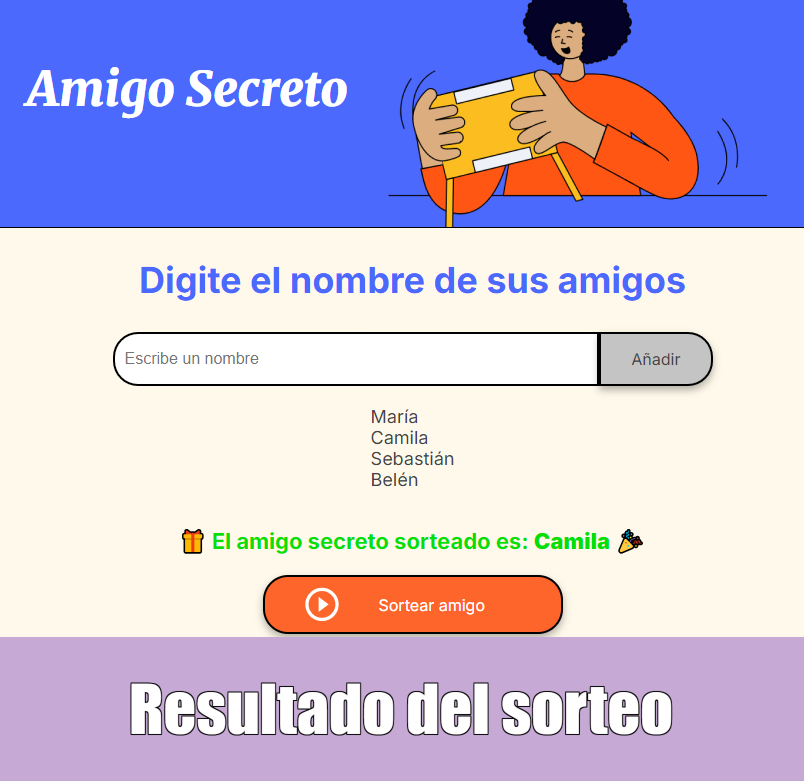

# 🎁 Amigo Secreto

Una mini app web para ingresar nombres, mostrar la lista y sortear un amigo secreto de forma aleatoria.  
Ideal para juegos y reuniones con amigos o familia.

---

## Índice

- [📌 Estado del proyecto](#-estado-del-proyecto)  
- [🖼 Vista previa](#-vista-previa)  
- [🛠 Tecnologías usadas](#-tecnologías-usadas)  
- [✨ Funcionalidades](#-funcionalidades)  
- [🚀 Próximas mejoras](#-próximas-mejoras)  
- [💻 Cómo usar](#-cómo-usar)  
- [🌐 Demo en vivo](#-demo-en-vivo)  
- [👩‍💻 Autora](#-autora)  
- [📄 Licencia](#-licencia)

---

## 📌 Estado del proyecto
✅ Versión funcional: se pueden agregar nombres (con validación y sin duplicados), mostrarlos en pantalla y realizar el sorteo aleatorio con un mensaje personalizado.

---

## 📸 Vista previa

<p align="center" style="max-width: 800px; margin: auto;">

  <figure style="display: inline-block; width: 45%; margin: 10px; border: 2px solid #ccc; border-radius: 8px; box-shadow: 1px 1px 5px rgba(0,0,0,0.1);">
    
    <figcaption style="text-align: center; font-weight: bold; margin-top: 5px;">Paso 1: Pantalla inicial limpia</figcaption>
  </figure>

  <figure style="display: inline-block; width: 45%; margin: 10px; border: 2px solid #ccc; border-radius: 8px; box-shadow: 1px 1px 5px rgba(0,0,0,0.1);">
    
    <figcaption style="text-align: center; font-weight: bold; margin-top: 5px;">Paso 2: Agregar un nombre</figcaption>
  </figure>

  <figure style="display: inline-block; width: 45%; margin: 10px; border: 2px solid #ccc; border-radius: 8px; box-shadow: 1px 1px 5px rgba(0,0,0,0.1);">
    
    <figcaption style="text-align: center; font-weight: bold; margin-top: 5px;">Paso 3: Lista con varios nombres</figcaption>
  </figure>

  <figure style="display: inline-block; width: 45%; margin: 10px; border: 2px solid #ccc; border-radius: 8px; box-shadow: 1px 1px 5px rgba(0,0,0,0.1);">
    
    <figcaption style="text-align: center; font-weight: bold; margin-top: 5px;">Paso 4: Resultado del sorteo</figcaption>
  </figure>

</p>

---

## 🛠 Tecnologías usadas

- HTML5  
- CSS3  
- JavaScript  

---

**Herramientas adicionales:**  
- Editor de código: Visual Studio Code  
- Control de versiones: Git y GitHub

---

## ✨ Funcionalidades
- Agregar nombres con validación
- Evitar duplicados
- Mostrar lista en pantalla
- Sorteo aleatorio con mensaje 🎉

---

## 🚀 Próximas mejoras
- Agregar botón para borrar la lista
- Guardar datos en LocalStorage
- Mejorar diseño visual con más estilos

---

## 💻 Cómo usar

1. Clonar el repositorio:
```bash
git clone https://github.com/belubullorini/challenge-amigo-secreto
```
2. Abrir el archivo index.html en tu navegador.
3. Escribir un nombre en el campo de texto y hacer clic en Agregar.
4. Una vez que haya nombres en la lista, hacer clic en Sortear amigo para obtener un ganador aleatorio.

---

## 🌐 Demo en vivo

Podés ver la app funcionando acá:  
[https://belubullorini.github.io/challenge-amigo-secreto/](https://belubullorini.github.io/challenge-amigo-secreto/)
  
---

## 👩‍💻 Autora
**Belén Bullorini**  
[LinkedIn](https://www.linkedin.com/in/belenbullorini) | [GitHub](https://github.com/belubullorini)

---

## 📄 Licencia

Este proyecto está bajo la licencia MIT.  
Para más detalles, ver el archivo [LICENSE](./LICENSE) en este repositorio.

---

✨ ¡Gracias por visitar el proyecto! 🎉👩‍💻 
